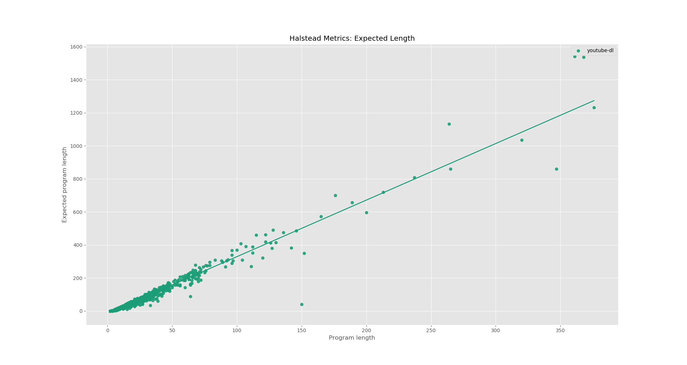

# halstead

`halstead` is a package to analyze the Halstead metrics of a Python git
repository. For now, it takes arbitrary git repositories, computes the Halstead
metrics on them, and plots the Halstead estimated length against the actual
length. For example, the command `halstead rg3/youtube-dl` produced the
following graphic:

